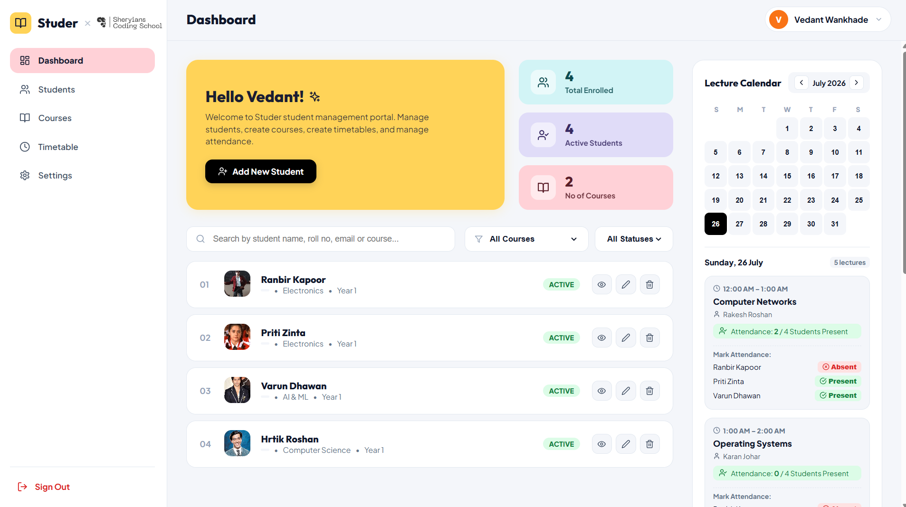
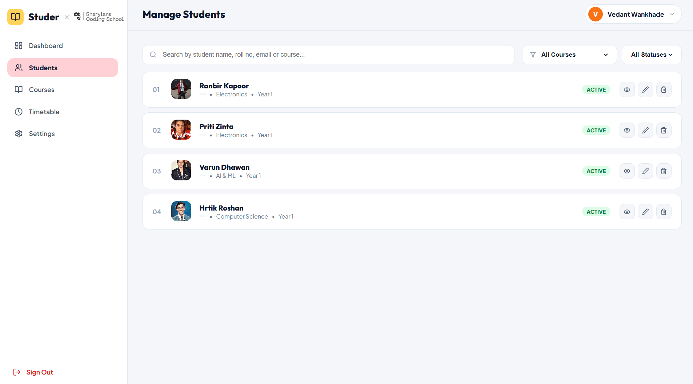
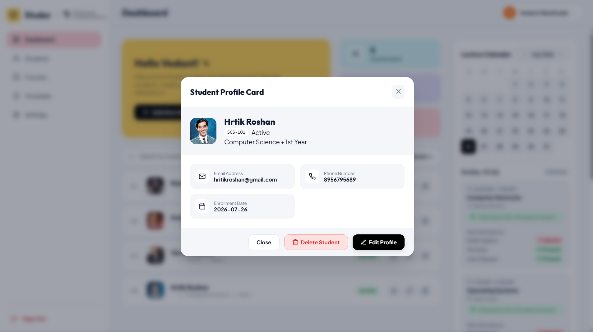
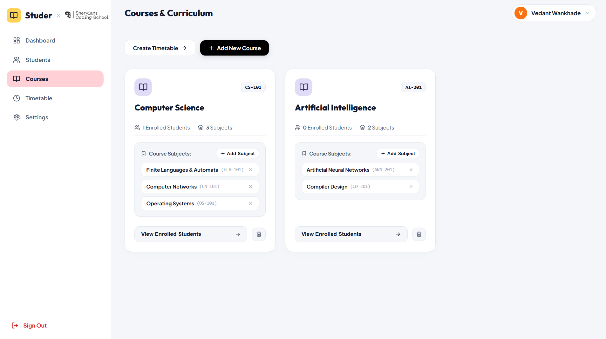
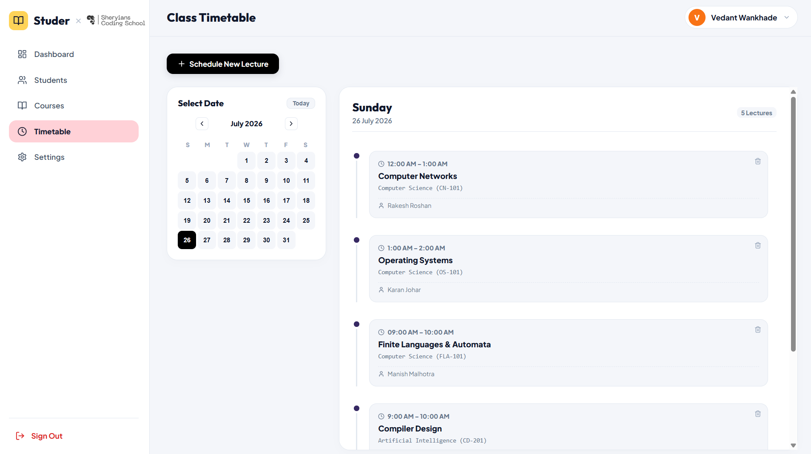

# 📘 Studer — Student Management System

A modern, full-featured **Student Management System** built with **React 18** and **Redux Toolkit**. Designed and developed as part of the **Sheryians Coding School Mini Hackathon**.

Studer provides a clean, intuitive interface for managing student records, courses & subjects, class timetables, and attendance — all in one place with real-time state management and localStorage persistence.

---

## 🚀 Features

- **Authentication** — Sign In / Sign Up with admin account management stored in localStorage.
- **Student CRUD** — Add, Edit, Delete, and View student records with full form validation.
- **Profile Images & Initials** — Display student profile photos when added, with automatic fallback to name initials.
- **Real-Time Stats** — Dashboard stats cards showing total enrolled, active students, and course count.
- **Search & Filtering** — Live search by name, roll number, email, or course with course and status filter dropdowns.
- **Lecture Calendar** — Interactive monthly calendar with date-based lecture scheduling and dot indicators for days with lectures.
- **Auto-Sorted Timetable** — Lectures automatically arrange themselves chronologically by start time for any selected date.
- **Attendance Tracking** — Mark student attendance per lecture directly from the dashboard's right widget.
- **Course & Subject Management** — Create courses, add subjects with codes and instructors, and link them to timetable slots.
- **LocalStorage Sync** — All data (students, courses, timetable, auth) persists across page refreshes.

---

## 🛠️ Tech Stack

| Layer              | Technology                           |
| ------------------ | ------------------------------------ |
| **Frontend**       | React 18                             |
| **State Management** | Redux Toolkit (`@reduxjs/toolkit`), `react-redux` |
| **Build Tool**     | Vite                                 |
| **Icons**          | Lucide React                         |
| **Styling**        | Vanilla CSS (Clean Light Theme)      |
| **Persistence**    | localStorage                         |

---

## 📸 App Screenshots & Pages

### 1. Landing Page


The **Landing Page** is the first screen users see when opening Studer. It features a full-screen hero section with a visually rich chalkboard-themed background. The header displays the **Studer** brand alongside the **Sheryians Coding School** logo. 

The centered tagline — *"Smart Academic Management, Simplified for Everyone"* — immediately communicates the app's purpose. Below it, a prominent **Sign In** button opens the authentication modal. Three feature pills at the bottom highlight the core modules: **Manage Students**, **Courses & Subjects**, and **Class Timetable**.

New admins can create an account via the Sign Up option, while returning users sign in with their credentials. Authentication state is persisted in localStorage so users stay logged in across sessions.

---

### 2. Dashboard



The **Dashboard** is the central hub after signing in. It is divided into three sections:

- **Hero Banner (Top Left):** A personalized greeting — *"Hello Vedant!"* — with a quick-action **Add New Student** button.
- **Stats Cards (Top Right):** Three real-time metric cards powered by Redux selectors showing **Total Enrolled**, **Active Students**, and **Number of Courses**. These update instantly as you add or remove records.
- **Student Directory (Center):** A searchable, filterable list of all students. Each row displays the student's **profile image** (or name initials as fallback), **name**, **course**, **year**, and **status badge** (Active / Graduated / On Leave). Action buttons for **View**, **Edit**, and **Delete** are available on every row. The search bar supports filtering by name, roll number, email, or course, while dropdown filters narrow results by course or enrollment status.
- **Lecture Calendar (Right Widget):** An interactive monthly calendar where clicking any date shows that day's scheduled lectures sorted by time. Each lecture card displays subject name, instructor, time slot, and an inline **attendance tracker** to mark students as Present or Absent. Days with scheduled lectures are marked with a small dot indicator on the calendar.

---

### 3. Manage Students



The **Manage Students** page provides a dedicated, full-width view of the student directory without the dashboard's side widgets. It is designed for focused student record management.

Each student row shows:
- **Serial number** and **profile photo** (with automatic initial-letter fallback if no image is set)
- **Student name**, **course**, and **academic year**
- **Status badge** — color-coded as Active (green), Graduated (blue), or On Leave (orange)
- **Action buttons** — Eye icon to view full profile, Pencil icon to edit, and Trash icon to delete with confirmation

The top bar includes the **search input** for live filtering and **dropdown filters** for Course and Status. Adding a new student opens a modal form with fields for name, roll number, email, phone, course, year, status, and an optional profile image URL.

---

### 4. Student Profile Card



Clicking the **View** (eye) icon on any student row opens the **Student Profile Card** modal. This is a detailed, read-only view of a single student's information presented in a clean card layout.

The profile card displays:
- **Profile image** (or initials avatar) alongside the student's **name**, **roll number badge**, **status badge**, **course**, and **year**
- **Contact details grid** — Email Address, Phone Number, and Enrollment Date, each displayed in its own info card with colored icons
- **Action footer** — Buttons to **Close** the modal, **Delete Student** (with confirmation prompt), or **Edit Profile** (which opens the edit form pre-filled with the student's data)

This modal can be triggered from any student list — both the Dashboard directory and the Manage Students page.

---

### 5. Courses & Curriculum



The **Courses & Curriculum** page manages the academic structure of the institution. It displays all created courses as cards in a grid layout.

Each course card includes:
- **Course name** and **course code** (e.g., Computer Science — `CS-101`)
- **Enrolled student count** and **subject count** — computed in real-time from the Redux store
- **Subjects list** — Each subject is shown with its name and code (e.g., *Finite Languages & Automata* `FLA-101`), with an `×` button to remove it
- **+ Add Subject** button — Opens a form to add a new subject with name, code, and instructor fields
- **View Enrolled Students** — Navigates to the Students tab filtered by this course
- **Delete Course** — Removes the course and all its subjects

The top toolbar has two actions: **Create Timetable** (navigates to the Timetable tab) and **+ Add New Course** (opens a modal to create a new course with a name and code). Subjects added here become selectable options when scheduling lectures in the Timetable.

---

### 6. Class Timetable



The **Class Timetable** page allows admins to schedule lectures on specific dates and view them organized by day.

The layout is split into two panels:
- **Calendar Panel (Left):** A full monthly calendar with navigation arrows and a **Today** button for quick access. Clicking any date selects it and loads that day's lectures in the right panel. Days that have scheduled lectures are visually indicated with dot markers.
- **Lectures Panel (Right):** Displays the **day name** (e.g., *Sunday*), **full date** (e.g., *26 July 2026*), and the **lecture count**. Lectures are presented in a **vertical timeline layout** with connected dots, automatically sorted by start time. Each lecture card shows the **time slot**, **subject name**, **course with code**, and **instructor name**. A delete button on each card removes the lecture.

The **+ Schedule New Lecture** button opens a modal where admins select a **course**, **subject** (auto-populated from the Courses page), pick a **date** (with the day name auto-derived), enter the **instructor name**, and set **start/end times**. Lectures are stored with their exact date, ensuring they appear only on the correct calendar day.

---

## 🏃 Getting Started

1. **Clone the repository:**
   ```bash
   git clone https://github.com/vedantwankhade123/Studer.git
   cd Studer
   ```

2. **Install dependencies:**
   ```bash
   npm install
   ```

3. **Run local development server:**
   ```bash
   npm run dev
   ```

4. **Build for production:**
   ```bash
   npm run build
   ```

---

## 📁 Project Structure

```
Studer/
├── Assets/                    # Screenshots for README
├── public/                    # Static assets
├── src/
│   ├── app/
│   │   └── store.js           # Redux store configuration
│   ├── assets/                # App assets (hero bg, logos)
│   ├── components/
│   │   ├── LandingPage.jsx    # Landing page with auth
│   │   ├── AuthModal.jsx      # Sign In / Sign Up modal
│   │   ├── Sidebar.jsx        # Navigation sidebar
│   │   ├── Navbar.jsx         # Top navigation bar
│   │   ├── HeroBanner.jsx     # Dashboard welcome banner
│   │   ├── StatsCards.jsx     # Dashboard stat cards
│   │   ├── FilterBar.jsx      # Search & filter controls
│   │   ├── StudentList.jsx    # Student directory list
│   │   ├── StudentCard.jsx    # Individual student card
│   │   ├── StudentAvatar.jsx  # Reusable avatar with fallback
│   │   ├── StudentModal.jsx   # Add/Edit student form
│   │   ├── StudentDetailModal.jsx # Student profile card
│   │   ├── CoursesView.jsx    # Courses & subjects manager
│   │   ├── TimetableView.jsx  # Date-based timetable
│   │   ├── RightWidget.jsx    # Calendar & attendance widget
│   │   └── SettingsView.jsx   # User settings page
│   ├── features/
│   │   ├── students/
│   │   │   └── studentsSlice.js
│   │   ├── courses/
│   │   │   └── coursesSlice.js
│   │   └── timetable/
│   │       └── timetableSlice.js
│   ├── App.jsx                # Root app with routing
│   ├── main.jsx               # Entry point
│   └── index.css              # Global styles
├── index.html
├── package.json
└── vite.config.js
```

---

## 🧠 State Management (Redux Toolkit)

Studer uses **three Redux slices** to manage application state:

| Slice | Purpose |
|-------|---------|
| `studentsSlice` | Student CRUD, search/filter state, modal controls |
| `coursesSlice` | Course & subject management, modal controls |
| `timetableSlice` | Lecture scheduling, date selection, attendance records |

All slices sync with **localStorage** for persistence. Selectors and helper functions (like `selectLecturesForDate` and `parseTimeToMinutes`) handle date-based filtering and chronological sorting.

---

## 📝 Default Credentials

| Field    | Value              |
|----------|--------------------|
| Email    | `admin@studer.com` |
| Password | `admin`            |

---

> Built with ❤️ by **Vedant Wankhade** for the **Sheryians Coding School Mini Hackathon**
